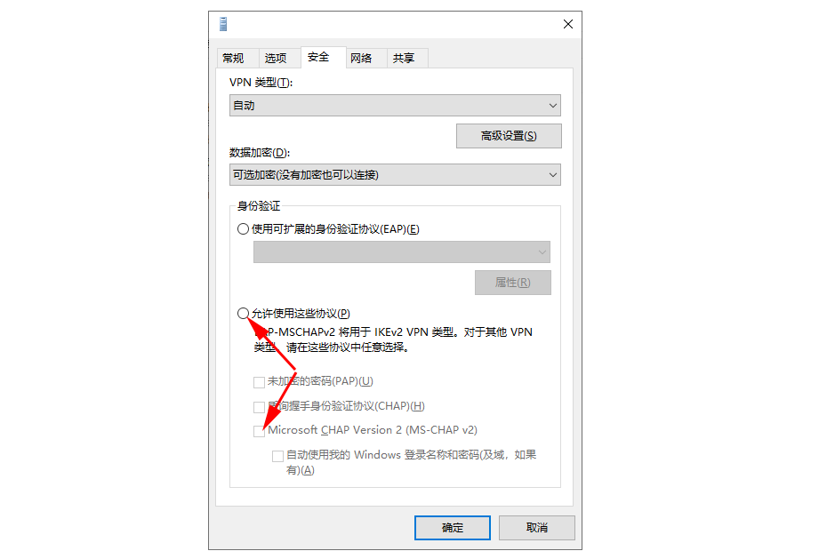

    重置网络后突然发现链接不上VPN了，链接报错：不能建立到远程计算机的连接,你可能需要更改此连接的网络设置。

### 故意修改成错误的密码
  - 先修改错误的密码在链接一次，如果提示密码错误说明是链接过去了的，发起了认证，只是建立VPN时报错

### 第三方VPN干扰
  - 本人电脑可以连接第三方VPN的同时链接windows的VPN，说明这个不影响

### 连接属性
  1. 在设置的网络里找到并打开更改适配器属性
  2. 找到VPN的那台小电脑右击选择属性
  3. 勾选如下选项
    

### IpPrioritizeRemote
  - 找到 C:\Users\你的用户名\AppData\Roaming\Microsoft\Network\Connections\Pbk\rasphone.pbk文件，使用j记事本打开
  - 找到 IpPrioritizeRemote= 属性， 修改值如果是0，就改为1

### WAN Miniport(IP)
  1. 打开设备管理器，卸载WAN Miniport(IP)
  2. 卸载完之后重启电脑
  注：禁用掉不行，必须卸载（我第一次禁用发现没成功）
  